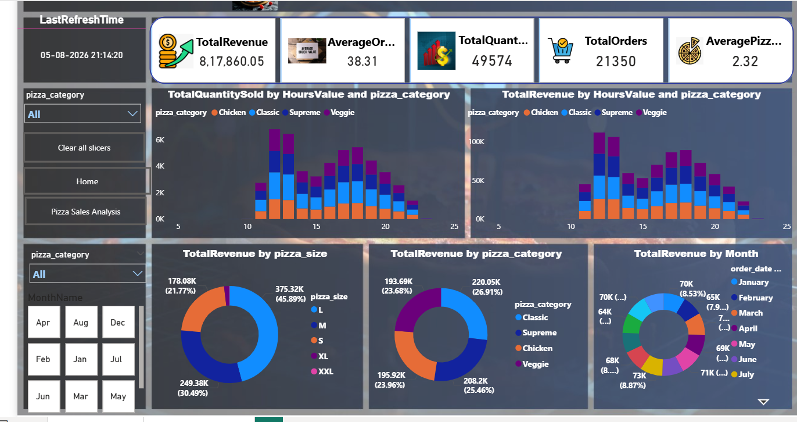
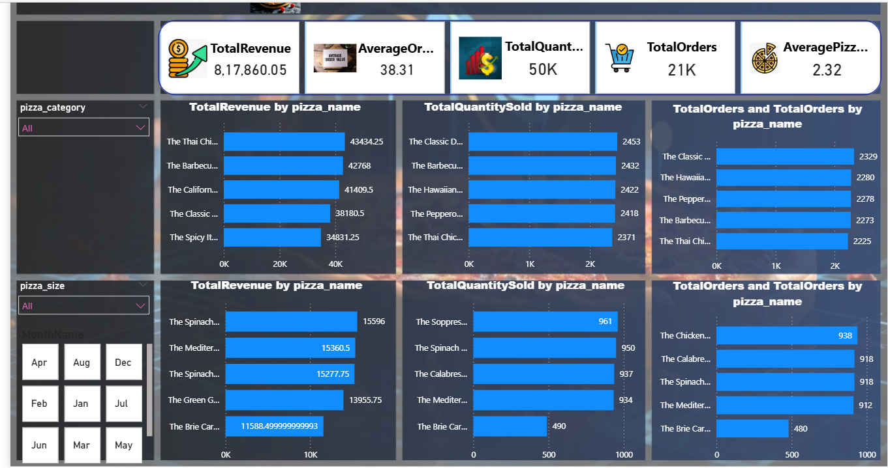

# Pizza Sales Analysis Dashboard

## Project Overview

This project is an interactive Power BI dashboard developed to analyze pizza sales performance. It provides business insights into revenue, sales trends, customer preferences, and product performance using interactive visualizations and KPIs.

## Tools Used

- Power BI
- DAX
- Microsoft Excel

## Dashboard Pages

### Business Overview

This dashboard provides an overall view of business performance through key performance indicators and sales trends.

**Key Insights:**
- Total Revenue
- Total Orders
- Total Quantity Sold
- Average Order Value
- Average Pizzas per Order
- Revenue by Pizza Category
- Revenue by Pizza Size
- Monthly Revenue Analysis
- Interactive Filters and Slicers

### Product Performance

This dashboard analyzes the performance of individual pizza products.

**Key Insights:**
- Top 5 Pizzas by Revenue
- Top 5 Pizzas by Quantity Sold
- Top 5 Pizzas by Orders
- Bottom 5 Pizzas by Revenue
- Bottom 5 Pizzas by Quantity Sold
- Bottom 5 Pizzas by Orders

## Project Files

- Pizza_Sales_Analysis.pbix
- pizza_sales.xlsx

## Dashboard Preview

### Business Overview

- Shows KPIs, revenue trends, sales by category, size, and month.

### Product Performance

- Shows top and bottom performing pizzas based on revenue, quantity sold, and orders.

## Author
Jennifer
